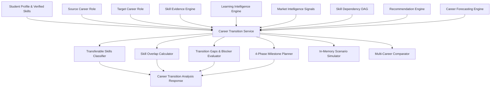

# Career Transition & Strategic Career Planning Specification

**Phase:** Phase 11  
**Project:** Skill2Career  
**Status:** Validated Specification  

---

## 1. System Mission & Boundary Definition

The **Career Transition Intelligence** system analyzes cross-role mobility between a student's source career profile and one or more candidate target career profiles. The system synthesizes:
- Authoritative student skill proficiencies (Phase 09A / 09A.1)
- Verified evidence artifacts (projects, certs, assessments) (Phase 09A)
- Longitudinal learning velocity and consistency (Phase 09B / 09B.1)
- Career readiness gaps and market demand (Phase 09C / 09C.1)
- Multi-horizon forecasting and scenario intelligence (Phase 10 / 10.1)
- Canonical Directed Acyclic Graph (DAG) prerequisite dependencies (Phase 08)

### Core Invariants & Prohibitions
1. **No Objective Career Rankings:** The system provides multi-dimensional factual comparisons; it NEVER ranks careers as "best" or declares winners.
2. **No Employment Probability:** The system computes competency acquisition effort and time-to-target; it NEVER promises hiring or predicts job offers.
3. **Pure In-Memory Simulation:** Counterfactual what-if scenarios never mutate authoritative MongoDB student states, create synthetic evidence, or overwrite active roadmaps.
4. **ML & Feature Invariance:** Phase 06 ML readiness pipelines, 13 canonical features, and model artifact weights remain 100% untouched.

---

## 2. Transition Domain Model & Data Flow

---

## 3. Transferable Skill Classification

Competencies are classified into 4 deterministic tiers:
1. **`DIRECTLY_TRANSFERABLE`**: The student possesses the skill at or above the target career's required proficiency level ($\text{Level}_{\text{student}} \ge \text{Level}_{\text{target}}$).
2. **`PARTIALLY_TRANSFERABLE`**: The student possesses demonstrated proficiency, but below the target career's requirement ($0 < \text{Level}_{\text{student}} < \text{Level}_{\text{target}}$).
3. **`ADJACENT`**: The skill is required for the target role and shared in the source curriculum, but no baseline proficiency is recorded yet.
4. **`NOT_YET_TRANSFERABLE`**: The competency is unestablished in the student profile.

---

## 4. Transition Gap Categorization & Remediation

Remediation gaps are categorized explicitly:
- **`MISSING_SKILL`**: Current level is 0.0.
- **`PREREQUISITE_BLOCKED`**: The skill has unfulfilled prerequisite dependencies in the DAG.
- **`STAGNATING_SKILL`**: Learning velocity for this skill has plateaued.
- **`INSUFFICIENT_EVIDENCE`**: Current proficiency is recorded without verified project/assessment evidence.
- **`LOW_PROFICIENCY`**: Baseline proficiency exists but requires elevation.

> [!NOTE]
> Mastered skills ($\text{gap} \le 0.0$) are strictly excluded from transition remediation gaps.

---

## 5. 4-Phase Transition Milestone Structure

1. **`M1_FOUNDATIONS` (Phase 1: Foundation & Prerequisites)**: Clears all blocking prerequisite dependencies and establishes baseline domain tooling.
2. **`M2_CORE_COMPETENCIES` (Phase 2: Core Domain Competencies)**: Bridges high-weight core domain requirements needed for primary responsibilities.
3. **`M3_SPECIALIZATION` (Phase 3: Specialization & Evidence Verification)**: Elevates secondary specialized competencies and builds auditable evidence items.
4. **`M4_CAPSTONE_VALIDATION` (Phase 4: Capstone & Readiness Validation)**: Synthesizes multi-skill competencies into an end-to-end production capstone.

---

## 6. REST API Endpoints

- `GET /api/v1/career-transition/{target_career_id}`: Full transition analysis.
- `GET /api/v1/career-transition/{target_career_id}/skills`: Transferable skills and overlap matrix.
- `GET /api/v1/career-transition/{target_career_id}/milestones`: Ordered prerequisite-aware milestones.
- `GET /api/v1/career-transition/{target_career_id}/evidence`: Transferable evidence items.
- `POST /api/v1/career-transition/{target_career_id}/plan`: Create or update strategic transition plan.
- `POST /api/v1/career-transition/compare`: Factual multi-career comparison (2 to 5 careers).
- `POST /api/v1/career-transition/simulate`: Pure in-memory what-if transition scenario simulation.
- `GET /api/v1/career-transition/history`: Student transition analysis audit history.
- `POST /api/v1/ai/explain-transition`: AI-grounded transition explanation.
