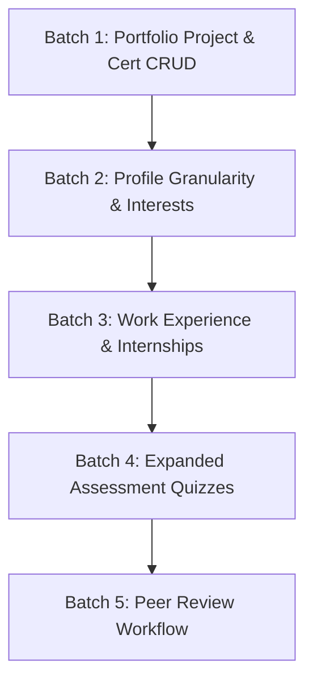

# SKILL2CAREER — MISSING FEATURE IMPLEMENTATION PLAN

This document outlines the systematic, prioritized roadmap to implement the partial and missing features identified in the [COMPLETE_SKILL2CAREER_FEATURE_AUDIT.md](file:///c:/Projects/Skill2Career/COMPLETE_SKILL2CAREER_FEATURE_AUDIT.md) report.

> [!IMPORTANT]
> **Constraints & Guarantees:**
> - ML Artifacts (`readiness_pipeline.joblib`, `trajectory_pipeline.joblib`) and the 13 canonical features will remain **100% untouched**.
> - All new features will maintain strict backward compatibility and preserve multi-tenant student data isolation.

---

## Batch 1: Portfolio CRUD Completeness (Highest Priority)
**Goal:** Enable full edit and delete lifecycle for Projects and Certifications without mutating ML artifacts.

### 1.1 Project Editing & Deletion
- **Backend:**
  - `PUT /api/v1/student/projects/{project_id}` in [student_router.py](file:///c:/Projects/Skill2Career/backend/routers/student_router.py)
  - `DELETE /api/v1/student/projects/{project_id}` in [student_router.py](file:///c:/Projects/Skill2Career/backend/routers/student_router.py)
  - Decrement `statistics.projects_count` on deletion.
  - Delete associated unverified evidence in `skill_evidence`.
- **Frontend:**
  - Add `updateProject` and `deleteProject` methods in [client.ts](file:///c:/Projects/Skill2Career/frontend/src/api/client.ts).
  - Add Edit and Delete action buttons to project cards in [PortfolioPage.tsx](file:///c:/Projects/Skill2Career/frontend/src/pages/PortfolioPage.tsx).
  - Add edit modal dialog.
- **Tests:** Add test cases in `backend/tests/test_api.py`.

### 1.2 Certification Editing & Deletion
- **Backend:**
  - `PUT /api/v1/student/certifications/{cert_id}` in [student_router.py](file:///c:/Projects/Skill2Career/backend/routers/student_router.py)
  - `DELETE /api/v1/student/certifications/{cert_id}` in [student_router.py](file:///c:/Projects/Skill2Career/backend/routers/student_router.py)
  - Decrement `statistics.certifications_count` on deletion.
- **Frontend:**
  - Add `updateCertification` and `deleteCertification` in [client.ts](file:///c:/Projects/Skill2Career/frontend/src/api/client.ts).
  - Add Edit and Delete actions in [PortfolioPage.tsx](file:///c:/Projects/Skill2Career/frontend/src/pages/PortfolioPage.tsx).
- **Tests:** Add test cases in `backend/tests/test_api.py`.

---

## Batch 2: Enhanced Profile Granularity (High Priority)
**Goal:** Expand profile schemas to explicitly distinguish Major/Branch, Academic Standing, and Technical Interests.

### 2.1 Schema & Profile Enhancements
- **Backend:**
  - Add `major: Optional[str]`, `academic_year: Optional[str]`, and `interests: Optional[List[str]]` to `ProfileUpdate` and `ProfileResponse` in [schemas.py](file:///c:/Projects/Skill2Career/backend/schemas/schemas.py).
  - Update `update_profile` in [student_router.py](file:///c:/Projects/Skill2Career/backend/routers/student_router.py) to persist these fields.
  - Integrate `interests` into [ai_context_builder.py](file:///c:/Projects/Skill2Career/backend/services/ai_context_builder.py) for enhanced AI career personalization.
- **Frontend:**
  - Add Major/Branch input, Academic Standing dropdown ("Year 1", "Year 2", "Year 3", "Year 4 / Senior", "Postgraduate"), and taggable Technical Interests in [ProfilePage.tsx](file:///c:/Projects/Skill2Career/frontend/src/pages/ProfilePage.tsx).
- **Tests:** Add verification in `test_new_user_empty_profile_integrity.py`.

---

## Batch 3: Work Experience & Internships Tracking (Medium Priority)
**Goal:** Provide dedicated tracking for industry internships and work experience.

### 3.1 Work Experience Collection & Endpoints
- **Backend:**
  - Create `ExperienceCreate`, `ExperienceResponse` in [schemas.py](file:///c:/Projects/Skill2Career/backend/schemas/schemas.py).
  - Add `db.work_experiences` collection in [indexes.py](file:///c:/Projects/Skill2Career/backend/database/indexes.py) with index on `student_id`.
  - Add `GET /api/v1/student/experiences`, `POST /api/v1/student/experiences`, `DELETE /api/v1/student/experiences/{id}` in [student_router.py](file:///c:/Projects/Skill2Career/backend/routers/student_router.py).
  - Feed total months of experience into `years_experience_avg` calculation for ML feature extractors.
- **Frontend:**
  - Add dedicated "Work Experience & Internships" tab in [PortfolioPage.tsx](file:///c:/Projects/Skill2Career/frontend/src/pages/PortfolioPage.tsx).
- **Tests:** Create `backend/tests/test_experience_tracking.py`.

---

## Batch 4: Assessment Authoring & Expanded Question Bank (Medium Priority)
**Goal:** Expand the assessment engine from 3 quizzes to cover more core skills, and provide administrative quiz authoring.

### 4.1 Assessment Authoring API & Additional Quizzes
- **Backend:**
  - Add `POST /api/v1/assessments` (Instructor/Admin endpoint) in [assessment_router.py](file:///c:/Projects/Skill2Career/backend/routers/assessment_router.py).
  - Seed 5 additional assessments for high-demand skills: SQL (SK008), TypeScript (SK003), FastAPI (SK015), Docker (SK034), and Data Structures (SK040) in [seed.py](file:///c:/Projects/Skill2Career/backend/database/seed.py).
- **Frontend:**
  - Expand [AssessmentsPage.tsx](file:///c:/Projects/Skill2Career/frontend/src/pages/AssessmentsPage.tsx) grid with search and category filters.
- **Tests:** Add quiz grading and submission tests in `test_api.py`.

---

## Batch 5: Peer Review & Endorsements (Longer-Term Future Expansion)
**Goal:** Allow students to request peer skill endorsements and review verified student projects.

### 5.1 Peer Review Workflow
- **Backend:**
  - Create `peer_reviews` collection.
  - Endpoints: `POST /api/v1/evidence/{id}/request-peer-review`, `POST /api/v1/evidence/{id}/submit-peer-review`.
  - Evidence weight awarded with `validator_type: 'PEER_REVIEW'`.
- **Frontend:**
  - Peer review request modal in [LearningEvidencePage.tsx](file:///c:/Projects/Skill2Career/frontend/src/pages/LearningEvidencePage.tsx).

---

## Recommended Implementation Sequence

1. **Phase 1 (Immediate Impact):** Batch 1 (Project/Cert edit & delete) & Batch 2 (Profile granularity).
2. **Phase 2 (Data Depth):** Batch 3 (Work Experience) & Batch 4 (Expanded Quizzes).
3. **Phase 3 (Collaboration):** Batch 5 (Peer Review).
