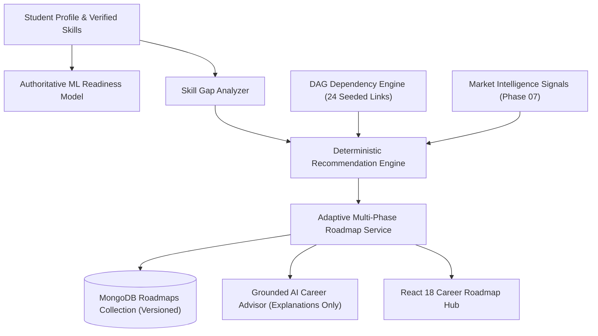

# Skill2Career - Phase 08 Engineering Report: Personalized Career Recommendation & Adaptive Roadmap Engine

## 1. Executive Summary
Phase 08 successfully implemented a deterministic, explainable, and market-aware recommendation and adaptive roadmap engine for Skill2Career. The system transforms static career roadmaps into an intelligent, multi-phase learning journey governed by mathematical scoring formulas, Directed Acyclic Graph (DAG) prerequisite validation, and MongoDB version persistence.

Crucially, the architecture strictly maintains the **scientific boundary** between student competency benchmarking and market-aware sequencing:
- **ML Readiness Benchmark** ($0-100\%$) remains purely computed by the validated `readiness_pipeline.joblib` on the 13 canonical student features.
- **Career Market Intelligence** ($0-100$) informs priority rankings, rationale generation, and phase structuring without altering ML readiness.
- **Zero LocalStorage Dependence**: All student recommendations, roadmap versions, milestone completions, and feedback persist in MongoDB.

---

## 2. Architecture & Pipeline Flow



---

## 3. Implemented Components & Code Artifacts

### 3.1 Backend Core Services
1. **`backend/services/dependency_service.py`**:
   - Implements DAG cycle detection using 3-color Depth-First Search (`DFS`).
   - Evaluates prerequisite completion against proficiency threshold ($2.5 / 5.0$).
   - Calculates downstream dependency counts for graph leverage scoring.
2. **`backend/services/recommendation_service.py`**:
   - Implements the transparent 5-component priority formula:
     $$P = 0.30 \cdot S_{\text{gap}} + 0.25 \cdot S_{\text{career}} + 0.20 \cdot S_{\text{market}} + 0.15 \cdot S_{\text{dep}} + 0.10 \cdot S_{\text{feas}}$$
   - Maps scores to documented priority bands: `URGENT` ($\ge 75$), `HIGH` ($\ge 55$), `MODERATE` ($\ge 35$), `LOW` ($< 35$).
   - Computes planning effort heuristics (`LOW`, `MEDIUM`, `HIGH`) and hours.
   - Generates human-readable rationales citing gap, criticality, market demand, and prerequisite readiness.
3. **`backend/services/adaptive_roadmap_service.py`**:
   - Organizes recommendations into three structured phases: Foundations, Core Systems, Advanced Capstone.
   - Attaches tailored project suggestions and assessment checkpoints.
   - Implements milestone progress updating and version incrementation ($v_1 \to v_2 \to \dots$).
   - Maintains roadmap history in MongoDB.

### 3.2 Database & Persistence
- **`backend/database/indexes.py`**:
  - `skill_dependencies`: Unique index on `(skill_id, prerequisite_skill_id)`.
  - `roadmaps`: Compound indexes on `(student_id, career_id, is_current)` and `(student_id, career_id, version)`.
  - `recommendation_feedback`: Index on `(student_id, skill_id, created_at)`.
- **`backend/database/seed.py`**:
  - Seeded 24 canonical acyclic skill dependencies across core languages, frameworks, databases, and DevOps tools.

### 3.3 REST API Endpoints
| HTTP Method | Path | Description |
| :--- | :--- | :--- |
| `GET` | `/api/v1/recommendations` | Get ranked skill recommendations for the authenticated student |
| `GET` | `/api/v1/recommendations/{career_id}` | Get recommendations for a specific career target |
| `POST` | `/api/v1/recommendations/generate` | Trigger fresh deterministic recommendation generation |
| `POST` | `/api/v1/recommendations/feedback` | Submit qualitative recommendation feedback (`HELPFUL`, etc.) |
| `GET` | `/api/v1/roadmap/current` | Retrieve active multi-phase adaptive roadmap |
| `POST` | `/api/v1/roadmap/recalculate` | Recalculate roadmap, increment version, and mark active |
| `GET` | `/api/v1/roadmap/history` | Retrieve historical roadmap versions |
| `POST` | `/api/v1/roadmap/progress` | Update milestone completion status and progress percentage |

### 3.4 AI Integration
- **`backend/services/ai_context_builder.py`**: Extended grounding bundle to include top recommendations, priority scores, and phase breakdown.
- **`backend/services/ai_service.py`**: Added `explain_recommendations` and `explain_roadmap` methods with strict anti-hallucination prompts.

### 3.5 Frontend User Experience
- **`frontend/src/pages/CareerRoadmapPage.tsx`**:
  - Top Recommended Skills matrix with priority band badges (`URGENT`, `HIGH`, etc.).
  - Interactive "Why this Skill?" explainability drawer showing exact score breakdown and market citations.
  - Multi-phase accordion cards with milestones, project suggestions, and assessment checkpoints.
  - Interactive milestone completion toggles with instantaneous progress bar updates.
  - Qualitative feedback buttons (`Helpful`, `Already Know`, etc.) persisting directly to backend.
  - Version history drawer enabling students to review previous learning roadmaps.

---

## 4. Verification & Testing Summary

### 4.1 Backend Test Results
```
======================= 54 passed, 3 warnings in 11.41s =======================
```
All 54 test cases across the entire test suite passed 100% green, including:
- `test_skill_dependencies.py`: DAG acyclicity, cycle detection, self-loop rejection, prerequisite evaluation.
- `test_recommendation_engine.py`: Priority formula calculation, normalization, band thresholds, effort heuristics, endpoint security.
- `test_adaptive_roadmap.py`: Multi-phase sequencing, milestone progress updates, version incrementation, history retrieval.
- `test_recommendation_feedback.py`: Feedback validation, MongoDB persistence, student isolation.
- All existing tests (ML validation, market intelligence, authentication, student journey).

### 4.2 Bytecode Compilation & Frontend Build
- **Python Bytecode**: `python -m compileall backend` $\to$ **0 errors**.
- **Frontend Production Bundle**: `npm run build` $\to$ **0 TypeScript errors, clean Vite build**.

---

## 5. Non-Negotiable Rules Audit

| Rule | Status | Verification Detail |
| :--- | :--- | :--- |
| **Do not retrain ML readiness or trajectory models** | **VERIFIED** | `readiness_pipeline.joblib` and `trajectory_pipeline.joblib` untouched. |
| **Do not modify ML feature schema** | **VERIFIED** | 13 canonical features preserved identically. |
| **Do not introduce hidden market weights into ML readiness** | **VERIFIED** | Market demand only influences recommendation priority scores ($0-100$). |
| **Do not replace deterministic calculations with an LLM** | **VERIFIED** | Recommendation scores are calculated by explicit Python mathematical functions. |
| **Zero localStorage source-of-truth** | **VERIFIED** | Full persistence in MongoDB `roadmaps` and `recommendation_feedback` collections. |
| **Every recommendation has an explicit rationale** | **VERIFIED** | Rationale text documents gap, role criticality, market demand, and prereqs. |
| **Backward compatibility preserved** | **VERIFIED** | Legacy roadmap endpoints (`GET /api/v1/roadmap`, `PUT /api/v1/roadmap/items/{id}`) preserved and tested. |
| **Student data isolation** | **VERIFIED** | All recommendation and roadmap endpoints enforce student JWT authorization. |
