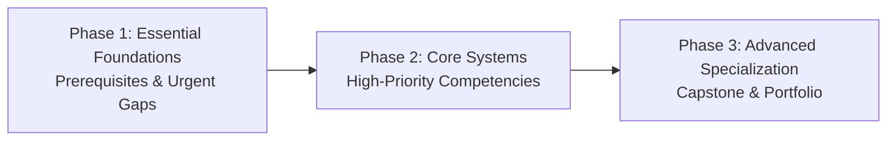

# Skill2Career - Recommendation Engine Specification (v2.0)

## 1. Executive Overview & Design Principles
The **Skill2Career Recommendation Engine** is a deterministic, explainable, and market-aware prioritization system that guides students through an optimized learning pathway toward their target career.

### Core Principles
1. **Mathematical Determinism**: Given the identical student competency state, career catalog requirements, external market signals, and skill dependency graph, the engine produces identical numerical priority scores and sequence orderings.
2. **Readiness Model Invariance**: External market demand signals inform recommendation rankings, but **never** modify the authoritative $0-100\%$ student ML readiness benchmark computed by the validated `readiness_pipeline.joblib`.
3. **Graph-Aware Sequencing**: Prerequisite skills are evaluated using a Directed Acyclic Graph (DAG) to ensure students build foundations before advanced specializations.
4. **Transparent Explainability**: Every recommendation includes a human-readable rationale explicitly documenting competency deficit, role criticality, market demand provenance, and prerequisite status.

---

## 2. Priority Scoring Mathematical Formula

For a student $S$, target career $C$, and candidate skill $K$, the raw priority score $P(S, C, K) \in [0, 100]$ is computed as:

$$P(S, C, K) = w_{\text{gap}} \cdot S_{\text{gap}} + w_{\text{career}} \cdot S_{\text{career}} + w_{\text{market}} \cdot S_{\text{market}} + w_{\text{dep}} \cdot S_{\text{dep}} + w_{\text{feas}} \cdot S_{\text{feas}}$$

### Component Weights ($w_i$)
| Component | Weight ($w_i$) | Description |
| :--- | :--- | :--- |
| **$S_{\text{gap}}$** | $0.30$ | Normalized competency deficit between target and current level |
| **$S_{\text{career}}$** | $0.25$ | Skill criticality/importance weight for the target career |
| **$S_{\text{market}}$** | $0.20$ | Provenance-backed external industry demand benchmark |
| **$S_{\text{dep}}$** | $0.15$ | Downstream graph leverage (unlocking dependent skills) |
| **$S_{\text{feas}}$** | $0.10$ | Prerequisite readiness + student learning velocity |

$$\sum w_i = 0.30 + 0.25 + 0.20 + 0.15 + 0.10 = 1.00$$

---

## 3. Sub-Score Normalization Methodology

### 3.1 Skill Gap Component ($S_{\text{gap}}$)
$$\Delta = \max(0.0, L_{\text{required}} - L_{\text{current}})$$
$$S_{\text{gap}} = \min\left(100.0, \frac{\Delta}{5.0} \times 100.0\right)$$
- If the student has no recorded level, $L_{\text{current}} = 0.0$.
- Standard rubric max level is $5.0$.

### 3.2 Career Relevance Component ($S_{\text{career}}$)
$$S_{\text{career}} = I_{\text{career}} \times 100.0$$
- $I_{\text{career}} \in [0.0, 1.0]$ represents the importance index defined in the career taxonomy matrix (e.g., O*NET technical competency weights).

### 3.3 Market Relevance Component ($S_{\text{market}}$)
$$S_{\text{market}} = D_{\text{market}}$$
- $D_{\text{market}} \in [0.0, 100.0]$ is retrieved from the `skill_market_signals` collection.
- Fallback default if market signal is unavailable: $75.0$ (neutral market benchmark).

### 3.4 Dependency Importance ($S_{\text{dep}}$)
$$S_{\text{dep}} = \min(100.0, N_{\text{downstream}} \times 25.0)$$
- $N_{\text{downstream}}$ is the count of catalog skills that declare skill $K$ as a prerequisite.
- Caps at $100.0$ when $\ge 4$ downstream skills are unlocked.

### 3.5 Learning Feasibility ($S_{\text{feas}}$)
$$S_{\text{feas}} = \text{PrereqPct} \times 0.70 + \min(30.0, V_{\text{learning}} \times 15.0)$$
- $\text{PrereqPct} \in [0.0, 100.0]$ is the percentage of prerequisite skills where $L_{\text{current}} \ge 2.5$.
- $V_{\text{learning}}$ is the student's historical learning velocity index (default $1.0$).

---

## 4. Priority Bands & Actionable Thresholds

| Priority Band | Score Threshold | Deficit Constraint | Actionable Meaning |
| :--- | :--- | :--- | :--- |
| **`URGENT`** | $P \ge 75.0$ | $\text{Gap} \ge 0.5$ | Critical career blocker; immediate learning action recommended in Phase 1. |
| **`HIGH`** | $55.0 \le P < 75.0$ | Any | Core professional skill; scheduled in Phase 2 for primary development. |
| **`MODERATE`** | $35.0 \le P < 55.0$ | Any | Supporting or specialized competency; scheduled in Phase 2/3. |
| **`LOW`** | $P < 35.0$ | Any | Minor deficit or elective capability; optional portfolio differentiator. |

---

## 5. Learning Effort Estimation Heuristics

Planning effort categories provide approximate timeframes for study scheduling without claiming exact hour guarantees:

| Effort Level | Condition | Approximate Planning Hours |
| :--- | :--- | :--- |
| **`LOW`** | $\text{Gap} < 1.5$ and prerequisites met | $\text{round}(\text{Gap} \times 20 + 5)$ hrs ($\approx 5 - 35$ hrs) |
| **`MEDIUM`** | $1.5 \le \text{Gap} < 3.0$ and prerequisites met | $\text{round}(\text{Gap} \times 22 + 10)$ hrs ($\approx 40 - 75$ hrs) |
| **`HIGH`** | $\text{Gap} \ge 3.0$ OR unmet prerequisites | $\min(90, \text{round}(\text{Gap} \times 24 + 15))$ hrs ($\approx 65 - 90$ hrs) |

---

## 6. Multi-Phase Adaptive Roadmap Structuring

Adaptive roadmaps organize recommendations into three sequential pedagogical phases:

1. **Phase 1 (Foundations & Prerequisites)**:
   - Resolves unmet prerequisites and `URGENT` foundation skills.
   - Includes practical foundational mini-project and diagnostic quiz checkpoint.
2. **Phase 2 (Core Engineering & Systems)**:
   - Targets primary role skills (`HIGH` and `MODERATE` priority bands).
   - Includes full-system architecture project and intermediate assessment checkpoint.
3. **Phase 3 (Specialization & Capstone)**:
   - Finalizes advanced optional/supporting tools and industry frameworks.
   - Culminates in a comprehensive end-to-end deployed portfolio capstone.

---

## 7. Versioning & Recalculation Lifecycle

- **Version Persistence**: When a student updates competencies or changes career target, a new version is created ($v_{N+1}$), marking prior versions with `is_current: false`.
- **History Preservation**: Past roadmaps remain accessible for longitudinal progress inspection via `GET /api/v1/roadmap/history`.
- **State Recalculation Triggers**:
  - Verification of a new skill assessment.
  - Adding or updating skill proficiency.
  - Completing a project milestone.
  - Changing target career role.
