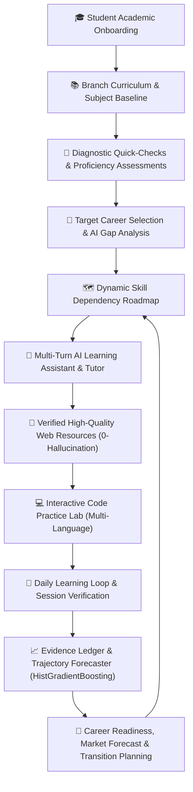

# Skill2Career 2.0 — End-to-End System Architecture & Student Journey

```
========================================================================================
                          SKILL2CAREER 2.0 ARCHITECTURE
   Continuous AI-Powered Academic Curriculum to Career Acceleration Platform
========================================================================================
```

---

## 1. System Vision & Core Paradigm Shift

Skill2Career 2.0 evolves from a standalone career readiness scoring dashboard into a **continuous learning-to-career ecosystem**. It bridges academic curriculums directly with real-time industry skill demands.



---

## 2. Comprehensive Student Journey

The platform enforces a continuous 16-step virtuous loop:

1. **Authentication & Identity Isolation:**
   - JWT-based authentication with bcrypt password hashing.
   - Strict multi-tenant isolation guaranteeing zero data leakage between students.
2. **Academic Onboarding Wizard (`/onboarding`):**
   - Degree Selection: B.Tech, B.S., BCA, M.S., MCA.
   - Branch / Major: Computer Science (CSE), AI & Machine Learning, Data Science, Information Technology, Cyber Security, Electronics & Communication, Mechanical, Civil, Electrical, Biotechnology, Chemical.
   - Academic Year & Semester (1st Year to Final Year / Postgrad).
3. **Branch-Specific Curriculum Catalog (`/subjects`):**
   - Core and Elective Subjects categorized by semester and branch.
   - Mapped canonical skills (e.g. `SK001` Python, `SK002` Data Structures, `SK003` TypeScript).
4. **Subject Knowledge Baseline:**
   - 1.0 - 5.0 self-rating scale (`NOVICE`, `BEGINNER`, `INTERMEDIATE`, `ADVANCED`, `EXPERT`).
   - Integrated diagnostic quiz launcher for automated objective verification.
5. **Initial Skill Profile Synthesis:**
   - Aggregates subject baselines into canonical student skill vectors.
6. **Career Target Selection (`/careers`):**
   - High-demand roles: Full-Stack Engineer, AI/ML Engineer, Cloud Architect, DevOps Engineer, Data Scientist, Cybersecurity Specialist, Mobile Developer, Backend Distributed Systems Engineer.
7. **Personalized Learning Path & Roadmaps (`/roadmap`):**
   - Directed Acyclic Graph (DAG) of prerequisite skills.
   - Dynamic unlocking of milestones based on verified student proficiency.
8. **AI Learning Tutor (`/ai-assistant`):**
   - Context-aware multi-turn conversations grounded in student branch, target career, and active gaps.
   - Educational Action Modes: `teach_topic`, `5_questions`, `explain_code`, `get_resources`, `project_idea`, `readiness_explanation`.
9. **Zero-Hallucination Learning Resources:**
   - Verified curated database of high-quality official documentation (MDN, Python.org, PyTorch.org, Fast.ai, AWS, Kubernetes).
10. **Practice & Coding Lab (`/practice`):**
    - Browser-based multi-language code editor (Python, JavaScript, TypeScript, C++, Java, C).
    - Sandboxed unit test execution engine with syntax checking, memory bounds, and execution timeout protection.
11. **Daily Learning Loop (`/dashboard`):**
    - Topic logger with study duration, activity type, confidence score, and optional 5-question comprehension check.
12. **Verified Evidence Engine (`/evidence`):**
    - Cryptographic and rule-grounded evidence ledger classifying strength (`WEAK`, `MODERATE`, `STRONG`, `VERY_STRONG`).
13. **Longitudinal Trajectory Forecaster:**
    - ML model (`HistGradientBoostingRegressor`) predicting 30, 60, 90-day readiness curves based on learning velocity, consistency, and study hours.
14. **Labor Market Intelligence & Fallback Resilience (`/market`):**
    - Live & cached government/industry demand signals (BLS, O*NET, Stack Overflow).
15. **Career Transition Simulator (`/transition`):**
    - Dynamic cross-career transition planning calculating transferable skill overlap and ramp-up schedules.
16. **Continuous Feedback Loop:**
    - Automatic recalibration of readiness scores upon each code submission, quiz pass, and evidence verification.

---

## 3. Layered Technical Architecture

```
+-----------------------------------------------------------------------------------+
|                                 FRONTEND (Vite + React + TS)                      |
|  - Academic Onboarding   - Subjects Explorer   - Practice Code Lab                |
|  - AI Learning Tutor     - Readiness Dashboard - Adaptive Roadmap Explorer        |
+-----------------------------------------+-----------------------------------------+
                                          | REST API (Bearer JWT)
+-----------------------------------------v-----------------------------------------+
|                               FASTAPI APPLICATION LAYER                           |
|  - curriculum_router     - practice_router     - ai_router                        |
|  - learning_intel_router - evidence_router     - ml_inference_router              |
+-----------------------------------------+-----------------------------------------+
                                          |
+-----------------------------------------v-----------------------------------------+
|                                SERVICE ORCHESTRATION LAYER                         |
|  - CurriculumService: Catalog mapping, baseline aggregation, diagnostic quizzer   |
|  - PracticeService: Safe code sandbox, multi-language test runners                |
|  - AIService: Multi-turn prompt engineering, context injection, resource linker   |
|  - LearningIntelligenceService: Velocity, streak, stagnation, longitudinal points |
|  - EvidenceService: Deterministic evidence strength scoring & verification        |
|  - MLInferenceService: HistGradientBoosting inference, SHAP local attributions    |
+-----------------------------------------+-----------------------------------------+
                                          |
+-----------------------------------------v-----------------------------------------+
|                               DATA & PERSISTENCE LAYER                            |
|  - MongoDB Atlas (Async PyMongo): 10 core collections + 10 curriculum collections |
|  - Canonical ML Artifacts: readiness_pipeline.joblib, trajectory_pipeline.joblib  |
|  - Seed Catalog: 5 Programs, 11 Branches, 10 Subjects, Challenges & Real Resources|
+-----------------------------------------------------------------------------------+
```

---

## 4. Database Collections & Relationships

| Collection | Description | Primary Key / Indexes |
| :--- | :--- | :--- |
| `academic_programs` | Degree definitions (BTech, BS, BCA, MS, MCA) | `program_code` (Unique) |
| `branches` | Majors associated with programs | `branch_code` (Unique), `program_id` |
| `subjects` | Academic course units mapped to skills | `subject_code` (Unique), `branch_code`, `semester` |
| `subject_baselines` | Student self-assessments and diagnostic test scores | `student_id` + `subject_code` (Unique Compound) |
| `practice_problems` | Coding lab exercises with test cases | `problem_code` (Unique), `category`, `difficulty` |
| `practice_attempts` | Student code submissions, execution stats & results | `student_id`, `problem_code`, `created_at` |
| `learning_sessions` | Daily study logs with notes & durations | `session_id` (Unique), `student_id`, `created_at` |
| `ai_conversations` | Multi-turn chat threads with AI tutor | `conversation_id` (Unique), `student_id`, `created_at`|
| `ai_messages` | Individual message turns with roles & context tags | `message_id` (Unique), `conversation_id`, `student_id` |
| `learning_resources` | Curated verified official web resources | `resource_id` (Unique), `skills`, `url` |
| `users` | Authenticated student credentials & roles | `email` (Unique), `_id` |
| `student_profiles` | Academic background, target careers & statistics | `user_id` (Unique) |
| `skill_evidence` | Verified skill evidence ledger | `evidence_id` (Unique), `student_id`, `skill_id` |
| `skills` | Canonical 50-skill taxonomy | `skill_code` (Unique) |
| `career_roles` | Canonical 10-role career definitions | `career_code` (Unique) |

---

## 5. Security & Isolation Safeguards

1. **Multi-Tenant Student Isolation:**
   - Every read and write query enforces `student_id = current_user.id` at the repository/service layer.
   - Cross-student access attempts reject with `403 Forbidden` or `404 Not Found`.
2. **Safe Code Execution Sandbox:**
   - Practice lab execution disallows dangerous Python standard modules (`os`, `sys`, `subprocess`, `socket`, `shutil`, `importlib`, `open`).
   - Strict 3.0s timeout per test suite and memory cap prevents resource exhaustion attacks.
3. **Deterministic ML Invariance:**
   - All 13 canonical features are extracted deterministically without data leakage.
   - Missing fields default to explicit unverified values (e.g., `0.0` or `False`), never synthetic approximations.
